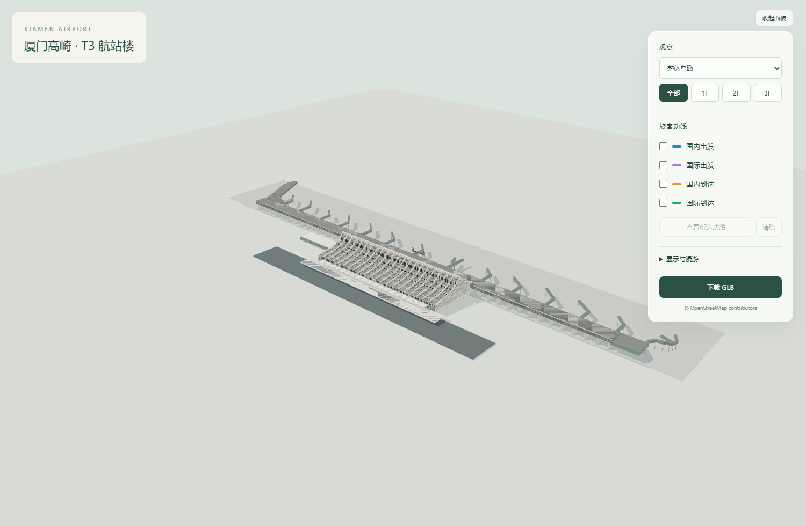
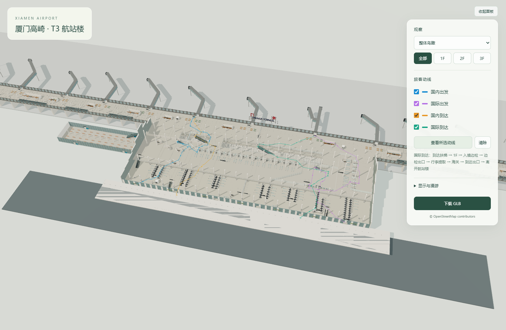

# 厦门高崎国际机场 T3 航站楼

厦门高崎国际机场 T3 航站楼的可交互三维还原项目，包含航站楼主体、登机长廊、廊桥、主要室内空间、楼层结构以及国内/国际出发与到达动线。

模型依据公开导览图、结构示意图、实拍照片和用户校正制作，适合建筑外观浏览、室内空间展示与旅客流程说明。项目并非测绘成果或施工图，缺少公开尺寸的局部结构采用了基于参考资料的估算。



## 功能

- 航站楼主体、曲面屋顶、端立面、登机长廊与廊桥
- 1F 到达、2F 值机与出发公共空间、3F 安检及候机空间
- 国内出发、国际出发、国内到达、国际到达四类旅客动线
- 10 个预设观察视角以及 1F、2F、3F 独立显示
- 屋顶、周边场地、室内设施和自动旋转开关
- WASD 平面移动、Q/E 升降、Shift 加速及速度调节
- 浏览器内直接下载 GLB

## 获取模型

GLB 体积较大，不存放在 Git 仓库中。请从 [Releases](https://github.com/duter646/xiamen-gaoqi-t3-model/releases) 下载 `xiamen-gaoqi-t3.glb`，放入：

```text
assets/xiamen-gaoqi-t3.glb
```

当前模型坐标单位为米，包含约 100 万个三角面。四类动线数据保存在 `assets/routes.json`。

## 本地预览

Windows PowerShell：

```powershell
./start_preview.ps1
```

然后打开 <http://127.0.0.1:8766/>。

也可以使用任意静态 HTTP 服务器在项目根目录启动预览。由于页面加载 GLB 和 JSON 资源，不能直接双击 `index.html` 以 `file://` 方式运行。

## 操作

| 操作 | 功能 |
|---|---|
| 鼠标左键拖动 | 旋转视角 |
| 鼠标滚轮 | 缩放 |
| WASD | 前后左右移动 |
| Q / E | 下降 / 上升 |
| Shift | 三倍移动速度 |

右侧面板可切换视角、楼层、设施显示和旅客动线。勾选一条或多条动线后，可使用“查看所选动线”定位。

## 旅客动线



- 国内出发：值机大厅 → 国内安检 → 国内候机区
- 国际出发：值机大厅 → 边防检查 → 安全检查 → 国际候机区
- 国内到达：国内到达廊道 → 下行扶梯 → 行李提取 → 出口
- 国际到达：国际到达廊道 → 下行扶梯 → 入境检查 → 行李提取 → 海关 → 出口

动线用于解释模型中的空间关系，并非机场实时运营导航。

## 项目结构

```text
.
├─ index.html                预览入口
├─ app.js                    Three.js 场景与交互
├─ style.css                 页面样式
├─ assets/
│  ├─ routes.json            四类旅客动线
│  └─ xiamen-gaoqi-t3.glb    从 Release 下载，不纳入 Git
├─ vendor/                   Three.js 浏览器依赖
├─ source/
│  ├─ build_routes.py        根据模型几何生成动线
│  └─ model/                 模型生成源码与建模输入
├─ references/               当前参考资料
├─ tests/                    几何、通路与浏览器检查
└─ archive/                  本地历史迭代，不纳入 Git
```

## 重新生成

模型生成入口：

```powershell
python source/model/build_revision.py
```

生成后将模型同步到 `assets`，再更新动线：

```powershell
Copy-Item source/model/xiamen-gaoqi-t3.glb assets/xiamen-gaoqi-t3.glb -Force
python source/build_routes.py
```

运行浏览器检查：

```powershell
node tests/viewer.cjs
```

模型生成需要 Python、NumPy 和 Pillow；浏览器检查需要 Node.js、Playwright 和可用的 Chromium/Edge。

## 验证范围

项目包含针对以下问题的检查：

- 安检后的通道与候机区连通
- 国际出发先经过边检，再经过安检
- 国内与国际到达区域隔离
- 两组到达扶梯的方向、跨层关系和净空
- 公共侧商店不能成为绕过安检的通路
- 主要挑空、楼板边界、栏杆支撑和门洞
- 预设视角、楼层切换、动线显示、移动控制和窄屏布局

这些检查验证当前程序化模型的几何与逻辑一致性，不等同于真实建筑测量认证。

## 数据与第三方组件

场地及部分平面关系参考 OpenStreetMap 数据，适用 ODbL。浏览器预览使用 Three.js，适用 MIT License。完整声明见 [THIRD_PARTY_NOTICES.txt](THIRD_PARTY_NOTICES.txt)。
